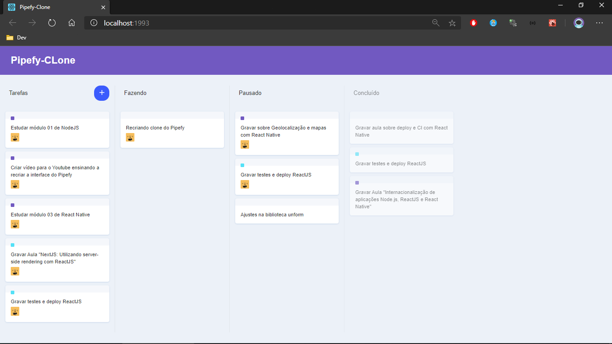

# Pipefy Clone
<p align="left">
  
</p>

:camera: Pipefy interface clone for drag and drop study with React




### Running Locally
```sh
# Install dependencies
yarn install

# Start the app on a new window
yarn start
```
